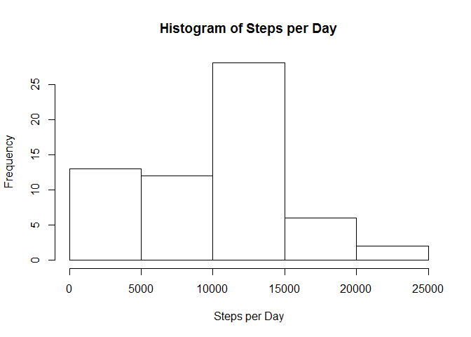

# Reproducible Research: Peer Assessment 1
## Loading and preprocessing the data

Code used to load file into R dataframe:


```r
setwd("C:/Users/Rich/Documents/Coursera_Reproducible_Research/")
act <- read.csv("activity.csv")
```

## What is mean total number of steps taken per day?

Calculate total steps per day:


```r
dates <- unique(act$date)
total <- NULL
for (i in 1:length(dates)) {
  total[i] <- sum(act$steps[act$date == dates[i]], na.rm=TRUE)
}
```

Create histogram of total steps per day:


```r
hist(total, xlab="Steps per Day",main="Histogram of Steps per Day")
```

 

Calculate mean and median tof total steps per day:


```r
mean(total)
```

```
## [1] 9354.23
```

```r
median(total)
```

```
## [1] 10395
```


## What is the average daily activity pattern?

```r
intv <- sort(unique(act$interval))
stps <- NULL
for (i in 1:length(intv)) {
  stps[i] <- as.integer(mean(act$steps[act$interval == intv[i]], na.rm=TRUE))
}

plot(intv, stps, type="l", xlab="Interval", ylab="Avg steps per day", main="Daily Activity Pattern")
```

 

Calculate interval with highest average number of steps:


```r
int2 <- cbind(intv, stps)
int2[int2[,2] == max(int2[,2])]
```

```
## [1] 835 206
```

## Imputing missing values

Determine number of missing values: 


```r
sum(is.na(act))
```

```
## [1] 2304
```

Replace missing values with the mean steps for the interval:


```r
for (i in 1:dim(act)[1]) {
  if (is.na(act$steps[i]) == TRUE) {
    act$steps[i] <- as.integer(mean(act$steps[act$interval == act$interval[i]], na.rm=TRUE))
  }
}
```

Create histogram with missing values replaced:


```r
dates <- unique(act$date)
total <- NULL
for (i in 1:length(dates)) {
  total[i] <- sum(act$steps[act$date == dates[i]], na.rm=TRUE)
}
hist(total, xlab="Steps per Day",main="Histogram of Steps per Day")
```

 

Calculate mean and median with missing values replaced:


```r
mean(total)
```

```
## [1] 10749.77
```

```r
median(total)
```

```
## [1] 10641
```

These values are higher since we added more steps to the data frame.


## Are there differences in activity patterns between weekdays and weekends?

Assign weekend/weekday values and create separate plots for each:


```r
for (i in 1:dim(act)[1]) {
  if (weekdays(as.Date(act$date[i])) == "Saturday") {
        act$day[i] <- "Weekend"
  } else {
     if (weekdays(as.Date(act$date[i])) == "Sunday") {
          act$day[i] <- "Weekend"
      } else {
          act$day[i] <- "Weekday" 
      }
  }
} 
stpd <- NULL
stpe <- NULL
actd <- subset(act, day == "Weekday")
acte <- subset(act, day == "Weekend")
intd <- sort(unique(actd$interval))
inte <- sort(unique(acte$interval))
for (i in 1:length(intd)) {
  stpd[i] <- as.integer(mean(actd$steps[actd$interval == intd[i]], na.rm=TRUE))
  }
for (i in 1:length(inte)) {
  stpe[i] <- as.integer(mean(acte$steps[acte$interval == inte[i]], na.rm=TRUE))
}
par(mfrow=c(1, 2))
plot(intd, stpd, type="l", xlab="Interval", ylab="Avg steps per day", main="Weekdays")
plot(inte, stpe, type="l", xlab="Interval", ylab="Avg steps per day", main="Weekend")
```

 

